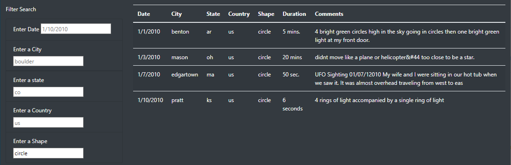
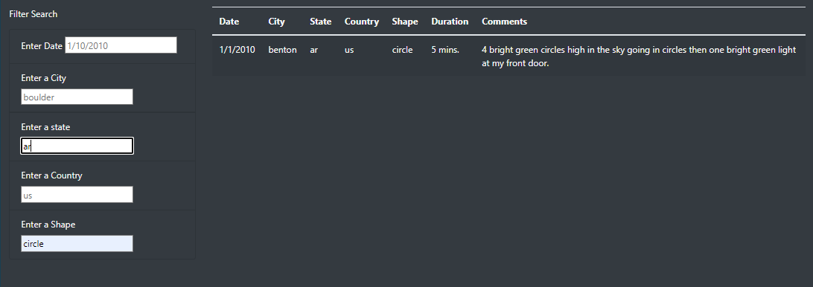

# UFO Sightings

## Overview

This initiative works on improving the web experience for users accessing the UFO Sightings webpage.  This is achieved by modifying the HTML and Javascript code to allow for multi-criteria search.  Previously, users could only search by date and with this update they can now search by state, country and shape as well.  Figure 1 shows the updated page.

***Figure 1: UFO Sightings Website***

## Results

Figures 2 through 4 shows the variety of searchs a user can enter.  As the user enters data they need to click outside the data entry field or press the enter key for the search to execute.  Once it executes the table is re-populated with the search results.  If no result are found the table is returned as empty.  To run another search the user has to clear the fields of the previous search and/or type over the criteria and then press enter.

***Figure 2: Date Search***

***Figure : Shape Search***

***Figure 4: Multi-filter Search Shape & State***

## Summary

Drawbacks:
- One drawback of this solution is the data file is static and old.
- The user experience is poor when using filters.  Such as the need to delete the data in the entry fields from a previous search.

Enchancements:
- Make the search filters more user friendly but allowing partial string searchs and remove the case sensitivity
- Clear the fields after a search is executed

